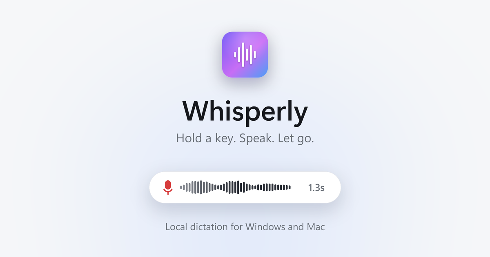
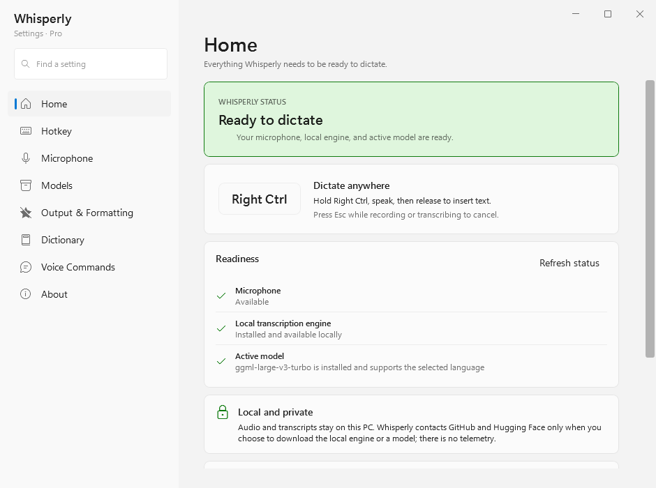

<p align="center">
  
</p>

<p align="center">
  <a href="https://mbn-code.github.io/whisperly-download/#windows"><b>Download for Windows</b></a>
  &nbsp;&middot;&nbsp;
  <a href="https://mbn-code.github.io/whisperly-download/#mac"><b>Download for Mac</b></a>
  &nbsp;&middot;&nbsp;
  <a href="https://github.com/mbn-code/whisperly-download/releases">All releases</a>
</p>

Whisperly is push-to-talk dictation that runs on your own computer. Hold a key,
say what you mean, let go, and the words are typed wherever your cursor is.
Speech is transcribed locally by [whisper.cpp](https://github.com/ggml-org/whisper.cpp).
There is no account, no cloud service and no telemetry.

This repository is where Whisperly is published: the website at
**[mbn-code.github.io/whisperly-download](https://mbn-code.github.io/whisperly-download/)**
and every build on the [releases page](https://github.com/mbn-code/whisperly-download/releases).
The source code is private.

## How it works

1. **Hold your key.** A small capsule appears with a live trace and a timer while you speak.
2. **Let go.** whisper.cpp turns the recording into text on your machine, with a model that stays loaded between dictations.
3. **The text lands at your cursor**, in whatever app you are in, after your dictionary and voice commands have run over it.

Esc cancels at any point. Every dictation is kept in a local history you can search and paste from again.

<p align="center">
  
</p>

## Windows and Mac

|               | Windows                                             | Mac                               |
| ------------- | --------------------------------------------------- | --------------------------------- |
| System        | Windows 10 or 11, 64-bit                            | macOS 14 or later, Apple silicon  |
| Default key   | Right Ctrl                                          | Right ⌘                           |
| Speech engine | Bundled; uses a Vulkan GPU when there is one        | `brew install whisper-cpp`        |
| Models        | Seven, from Tiny (75 MB) to Large v3 Turbo (1.6 GB) | Five, from Tiny to Large v3 Turbo |
| Languages     | 100, plus auto-detect                               | English, plus nine more           |
| Install       | Per-user installer, no administrator prompt         | Disk image                        |

The website has the install steps for each, the release notes for the current
build and its checksum.

## Privacy

Your audio never leaves your computer. Whisperly goes online only to:

- download the speech models you choose, from Hugging Face;
- check once a day whether a newer version is out (on Windows, this can be turned off in Settings, under About);
- on Windows, download a processor-only engine from GitHub if you choose to install one.

Windows also has an optional prompt mode, shaped by a local model through
Ollama by default. If you switch its provider to a cloud model, the text you
dictate in prompt mode is sent to that service, through your own sign-in.

## Pro

Whisperly is free to use. Pro is a one-time $29 license that adds the two
largest models, Medium and Large v3 Turbo, and the history picker. There is no
subscription and no account: the key is checked on your computer. Write to
[malthe@mbn-code.dk](mailto:malthe@mbn-code.dk?subject=Whisperly%20Pro) for a
license, then paste it into Settings, under About. More on the
[Pro page](https://mbn-code.github.io/whisperly-download/#pro).

## Verify a download

Each release carries a `.sha256` file next to every download, and the website
shows the hash of the current build.

```powershell
# Windows, in PowerShell
Get-FileHash .\WhisperlySetup-*.exe -Algorithm SHA256
```

```sh
# Mac, in Terminal
shasum -a 256 Whisperly.dmg
```

The installers are not code-signed or notarized yet, so Windows SmartScreen and
macOS Gatekeeper ask before the first launch. The website explains what to click.

## Problems and ideas

[Open an issue](https://github.com/mbn-code/whisperly-download/issues/new/choose)
for a bug or an idea. Security problems should be reported privately, as
[SECURITY.md](SECURITY.md) describes.

## Credits

Speech recognition by [whisper.cpp](https://github.com/ggml-org/whisper.cpp)
and OpenAI's [Whisper](https://github.com/openai/whisper) models, both MIT
licensed.

Publishing a release or changing the website is described in
[PUBLISHING.md](PUBLISHING.md).
